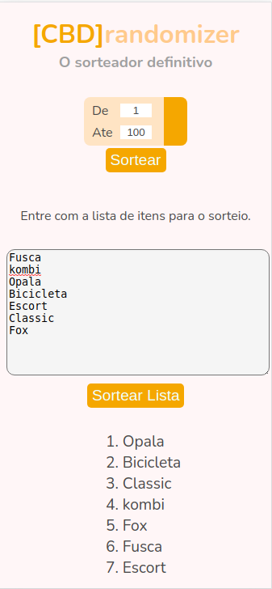

# sorteador

Este projeto consiste em um sistema de sorteios de números aleatórios conforme o range definido e
tambem sortei de itens em uma lista.

[Confira a implemetação aqui](https://enicio.github.io/randomizer)
